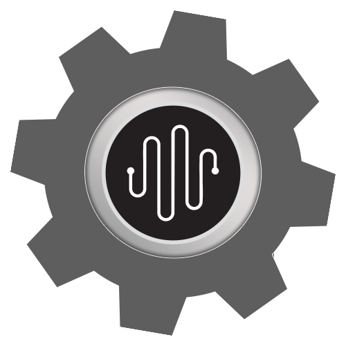

# Beat Kitchen Audio Tools



A right-click utility for macOS that measures loudness and converts audio files — directly from Finder.

## What It Does

Right-click any audio or video file and select **Beat Kitchen Audio Tools** to get:

- **Integrated Loudness** (LUFS) — the overall perceived loudness
- **True Peak** (dBTP) — the absolute signal peak
- **Loudness Range** (LRA) — how much the loudness varies
- **Loudest Moment** — timestamp of the peak momentary loudness so you can find it

Results appear in a dialog with a **Copy** button for pasting into notes or a session log.

The **Convert** menu offers:
- **Convert to MP3** (320kbps) — saves alongside the original
- **Stereo to Mono** — saves as `filename_mono.ext` alongside the original
- **Normalize** — EBU R128 loudness normalization to a target (presets for -14, -16, -23 LUFS or custom). Saves as `filename_-14LUFS.ext`

Works on WAV, AIFF, MP3, FLAC, and any format ffmpeg supports — including video files (MP4, MOV, etc.).

## Install

### Download

Grab the latest `.dmg` from the [Releases page](https://github.com/BeatKitchen/bks-audio-tools/releases).

1. Open the `.dmg`
2. Double-click `Beat Kitchen Audio Tools.pkg`
3. Follow the installer prompts
4. Done — the tool is ready to use

ffmpeg is downloaded automatically on first use if you don't already have it installed.

### From Source

```bash
git clone https://github.com/BeatKitchen/bks-audio-tools.git
cd bks-audio-tools
./build.sh
./install.sh
```

## Requirements

- macOS 12 (Monterey) or later
- ffmpeg (auto-downloaded on first use, or install via `brew install ffmpeg`)

## Usage

1. Right-click any audio or video file in Finder
2. Go to **Services** (or **Quick Actions** on macOS 13+)
3. Click **Beat Kitchen Audio Tools**

## Uninstall

```bash
rm -rf ~/Library/Services/Beat\ Kitchen\ Audio\ Tools.workflow
```

To also remove the auto-downloaded ffmpeg:
```bash
rm -rf ~/.bks-audio-tools
```

## License

MIT

---

Made by [Beat Kitchen School](https://beatkitchen.io)
